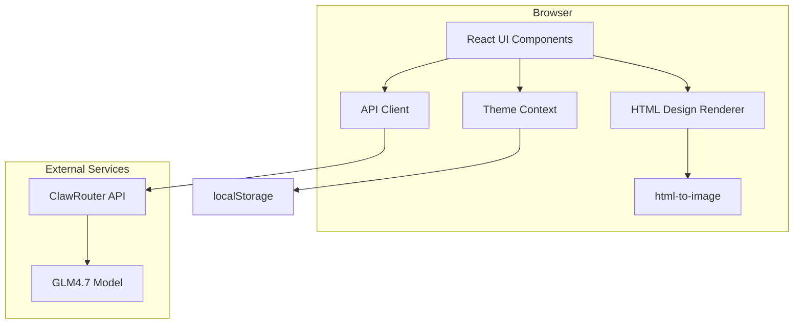

# Design Document

## Overview

AI Designer — веб-приложение для генерации дизайнов приглашений на выпускной с использованием AI-модели GLM4.7 через ClawRouter. Приложение построено на React + TypeScript + Vite с минималистичным чёрно-белым интерфейсом и поддержкой dark/light mode.

### Key Design Decisions

1. **Client-side HTML to Image conversion**: Используем библиотеку `html-to-image` для конвертации HTML в изображение прямо в браузере. Это устраняет необходимость в серверном рендеринге и упрощает архитектуру.

2. **OpenAI-compatible API**: ClawRouter предоставляет OpenAI-совместимый API endpoint, что позволяет использовать стандартный подход для интеграции с AI-моделью.

3. **CSS Variables for theming**: Используем CSS custom properties для переключения тем, что обеспечивает плавные переходы и простую поддержку.

4. **localStorage for persistence**: Сохраняем выбранную тему в localStorage для восстановления при повторном посещении.

## Architecture



### Data Flow

1. Пользователь вводит промпт в UI
2. UI отправляет запрос через APIClient к ClawRouter
3. ClawRouter маршрутизирует запрос к GLM4.7
4. GLM4.7 генерирует HTML-дизайн
5. UI отображает HTML через DesignRenderer
6. ImageConverter конвертирует HTML в PNG
7. Пользователь скачивает изображение

## Components and Interfaces

### Core Components

#### App
Главный компонент приложения. Обёртка для ThemeProvider и основного layout.

```typescript
interface AppProps {}
```

#### ThemeProvider
Context provider для управления темой интерфейса.

```typescript
interface ThemeContextValue {
  theme: 'dark' | 'light';
  toggleTheme: () => void;
}
```

#### MainPage
Главная страница с полем ввода промпта и областью отображения результата.

```typescript
interface MainPageProps {}

interface MainPageState {
  prompt: string;
  generatedHTML: string | null;
  generatedImage: string | null;
  isLoading: boolean;
  error: string | null;
}
```

#### PromptInput
Компонент поля ввода промпта.

```typescript
interface PromptInputProps {
  value: string;
  placeholder: string;
  onChange: (value: string) => void;
  onSubmit: () => void;
  disabled: boolean;
}
```

#### DesignPreview
Компонент для отображения сгенерированного HTML-дизайна.

```typescript
interface DesignPreviewProps {
  html: string;
  onConvert: () => void;
}
```

#### ImageResult
Компонент для отображения сконвертированного изображения и кнопки скачивания.

```typescript
interface ImageResultProps {
  imageUrl: string;
  onDownload: (filename: string) => void;
}
```

#### ThemeToggle
Кнопка переключения темы.

```typescript
interface ThemeToggleProps {
  theme: 'dark' | 'light';
  onToggle: () => void;
}
```

#### LoadingIndicator
Индикатор загрузки.

```typescript
interface LoadingIndicatorProps {
  message?: string;
}
```

#### ErrorMessage
Компонент отображения ошибки.

```typescript
interface ErrorMessageProps {
  message: string;
  onRetry?: () => void;
}
```

### Services

#### APIClient
Сервис для взаимодействия с ClawRouter API.

```typescript
interface APIClientConfig {
  baseUrl: string;
  apiKey: string;
  model: string;
}

interface GenerateRequest {
  prompt: string;
  systemPrompt: string;
}

interface GenerateResponse {
  html: string;
}

interface APIError {
  code: string;
  message: string;
}

class APIClient {
  constructor(config: APIClientConfig);
  generateDesign(request: GenerateRequest): Promise<GenerateResponse>;
}
```

#### ImageConverter
Сервис для конвертации HTML в изображение.

```typescript
interface ConvertOptions {
  quality?: number;
  pixelRatio?: number;
}

interface ConvertResult {
  dataUrl: string;
  width: number;
  height: number;
}

class ImageConverter {
  convert(html: string, options?: ConvertOptions): Promise<ConvertResult>;
}
```

## Data Models

### Theme
```typescript
type Theme = 'dark' | 'light';
```

### DesignState
```typescript
interface DesignState {
  status: 'idle' | 'generating' | 'converting' | 'ready' | 'error';
  prompt: string;
  html: string | null;
  image: string | null;
  error: Error | null;
}
```

### API Response
```typescript
interface ClawRouterResponse {
  id: string;
  object: string;
  choices: Array<{
    index: number;
    message: {
      role: string;
      content: string;
    };
    finish_reason: string;
  }>;
}
```

### Error Types
```typescript
enum ErrorCode {
  NETWORK_ERROR = 'NETWORK_ERROR',
  API_ERROR = 'API_ERROR',
  CONVERSION_ERROR = 'CONVERSION_ERROR',
  SERVICE_UNAVAILABLE = 'SERVICE_UNAVAILABLE',
}

interface AppError {
  code: ErrorCode;
  message: string;
  details?: unknown;
}
```

## Error Handling

### Error Categories

1. **Network Errors** — проблемы с соединением
   - Отображение сообщения о проблеме с соединением
   - Предложение повторить запрос

2. **API Errors** — ошибки от ClawRouter
   - Парсинг ответа с ошибкой
   - Отображение информативного сообщения
   - Логирование для отладки

3. **Conversion Errors** — ошибки конвертации HTML в изображение
   - Fallback на отображение HTML
   - Предупреждение пользователя

4. **Service Unavailable** — ClawRouter недоступен
   - Проверка health endpoint
   - Отображение сообщения о недоступности сервиса

### Error Handling Strategy

```typescript
function handleAPIError(error: unknown): AppError {
  if (error instanceof TypeError && error.message.includes('fetch')) {
    return {
      code: ErrorCode.NETWORK_ERROR,
      message: 'Проблема с соединением. Проверьте подключение к интернету.',
    };
  }
  
  if (error instanceof Response) {
    if (error.status >= 500) {
      return {
        code: ErrorCode.SERVICE_UNAVAILABLE,
        message: 'Сервис временно недоступен. Попробуйте позже.',
      };
    }
    return {
      code: ErrorCode.API_ERROR,
      message: 'Ошибка при генерации дизайна. Попробуйте изменить промпт.',
    };
  }
  
  return {
    code: ErrorCode.API_ERROR,
    message: 'Произошла непредвиденная ошибка.',
    details: error,
  };
}
```

## Testing Strategy

### Unit Tests

- Компоненты UI: рендеринг, взаимодействие, state changes
- ThemeContext: переключение темы, сохранение в localStorage
- APIClient: формирование запросов, обработка ответов
- ImageConverter: конвертация HTML в изображение
- Error handling: корректная обработка всех типов ошибок

### Integration Tests

- Полный цикл генерации: промпт → HTML → изображение
- Интеграция с ClawRouter API (с mock сервером)
- Сохранение и восстановление темы

### E2E Tests

- Пользовательский сценарий: ввод промпта → генерация → скачивание
- Переключение темы
- Обработка ошибок

### Test Configuration

- **Framework**: Vitest для unit и integration тестов
- **E2E**: Playwright для end-to-end тестов
- **Coverage**: Минимум 80% code coverage

### Test Cases

#### Unit Tests

1. **PromptInput**
   - Отображение placeholder при пустом значении
   - Вызов onChange при вводе
   - Вызов onSubmit при нажатии Enter
   - Блокировка ввода при disabled=true

2. **ThemeToggle**
   - Отображение текущей темы
   - Вызов onToggle при клике

3. **APIClient**
   - Формирование корректного запроса к ClawRouter
   - Обработка успешного ответа
   - Обработка ошибок сети
   - Обработка ошибок API

4. **ImageConverter**
   - Конвертация простого HTML в PNG
   - Обработка сложного HTML с CSS
   - Обработка ошибок конвертации

#### Integration Tests

1. **Генерация дизайна**
   - Ввод промпта → отправка запроса → получение HTML
   - Отображение loading state во время запроса
   - Отображение ошибки при неудаче

2. **Конвертация в изображение**
   - HTML → конвертация → отображение изображения
   - Fallback на HTML при ошибке конвертации

3. **Скачивание изображения**
   - Клик на кнопку → скачивание PNG файла

#### E2E Tests

1. **Полный цикл генерации**
   - Открыть главную страницу
   - Ввести промпт
   - Нажать кнопку генерации
   - Дождаться результата
   - Скачать изображение

2. **Переключение темы**
   - Открыть страницу
   - Нажать кнопку переключения темы
   - Проверить изменение цветов
   - Перезагрузить страницу
   - Проверить сохранение темы

3. **Обработка ошибок**
   - Симулировать ошибку сети
   - Проверить отображение сообщения об ошибке
   - Нажать кнопку повтора


## Correctness Properties

*A property is a characteristic or behavior that should hold true across all valid executions of a system—essentially, a formal statement about what the system should do. Properties serve as the bridge between human-readable specifications and machine-verifiable correctness guarantees.*

### Property 1: Theme toggle switches to opposite state

*For any* current theme state (dark or light), toggling the theme must result in the opposite theme state.

**Validates: Requirements 2.2**

### Property 2: HTML to image conversion produces valid output

*For any* valid HTML string, the image conversion function must produce a valid PNG data URL (starting with `data:image/png;base64,`).

**Validates: Requirements 4.1**

### Property 3: Responsive layout stays within viewport bounds

*For any* viewport width between 320px and 1920px, all visible UI elements must remain within the viewport boundaries (no horizontal overflow).

**Validates: Requirements 7.1**
